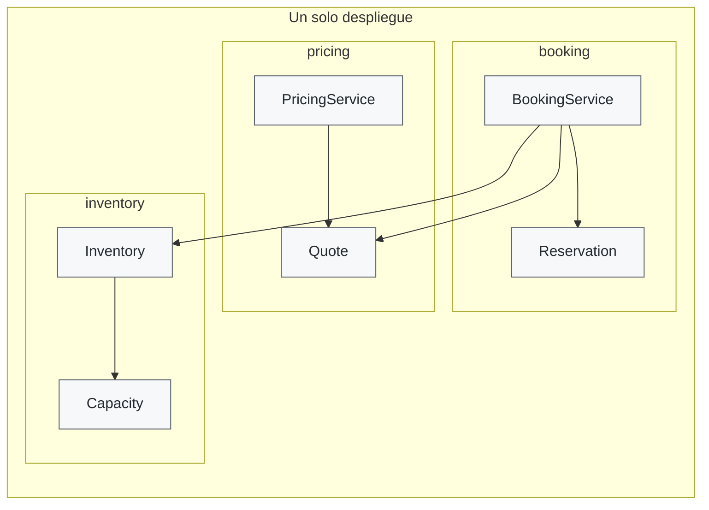

# Diagrama: Monolito modular

El diagrama muestra un solo despliegue con tres módulos internos. La frontera no
es una red ni un proceso separado: es una regla de dependencia y visibilidad.
`booking` puede pedir una reserva a `inventory` mediante un contrato interno,
pero no modifica sus campos privados.
