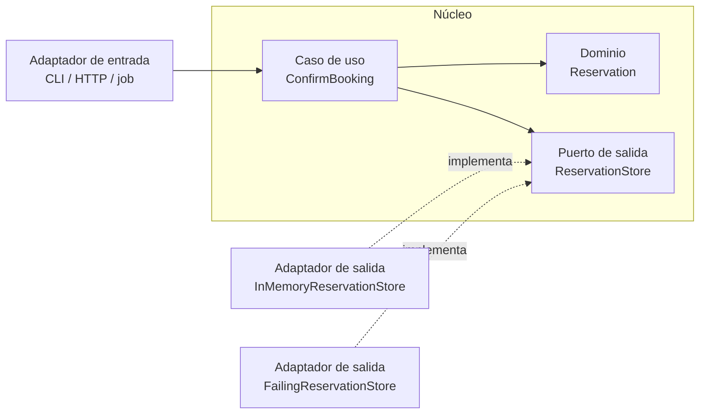

# Diagrama: Arquitectura hexagonal

La dirección de dependencia apunta hacia el núcleo. El caso de uso conoce el
puerto `ReservationStore`, no el adaptador concreto. Los adaptadores pueden
cambiar sin reescribir la regla de confirmación.
