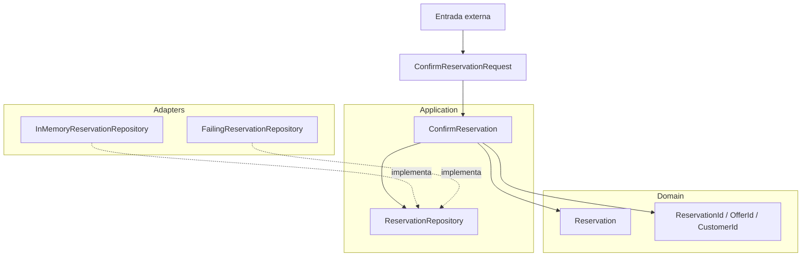

# 03. Clean Architecture

La dirección importante es hacia las reglas estables. El caso de uso transforma
datos primitivos en tipos del dominio, la entidad conserva sus invariantes y los
adaptadores implementan el contrato de persistencia desde afuera.
