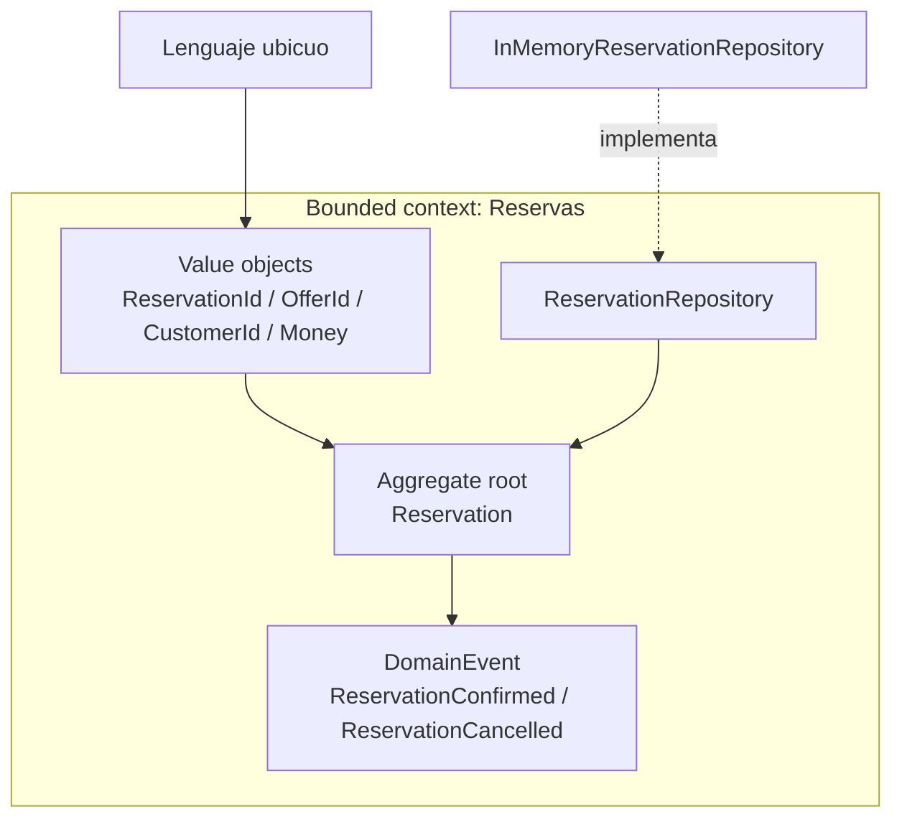

# 04. Domain-Driven Design

El agregado `Reservation` es la frontera de consistencia. Los value objects
protegen lenguaje local, los eventos nombran hechos ocurridos y el repositorio
guarda el agregado sin decidir sus transiciones.
