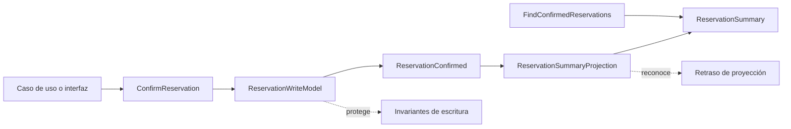

# 05. CQRS

El comando expresa una intención de cambio. El modelo de escritura valida la
intención, protege invariantes y produce un hecho observable. La proyección
convierte ese hecho en una vista de lectura. La consulta lee la vista sin volver
a ejecutar reglas de escritura ni mutar la proyección.
