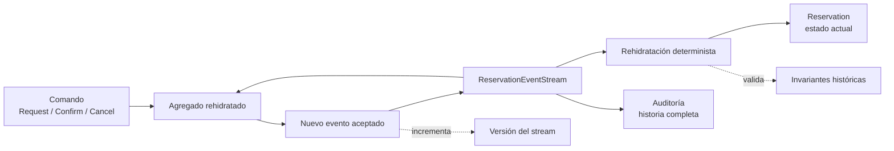

# 06. Event sourcing

El stream guarda hechos aceptados en orden. El agregado se rehidrata desde esa
historia antes de decidir si un comando puede producir un nuevo evento. La
auditoría no es una tabla secundaria: es la misma historia que permite explicar
el estado actual.
