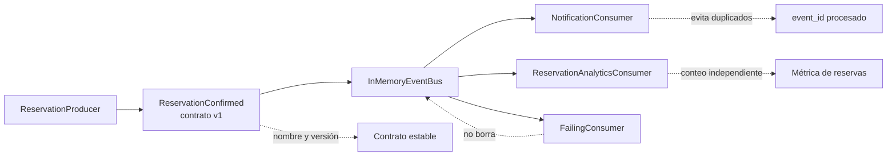

# 07. Arquitectura orientada a eventos

El productor publica un hecho de integración con contrato explícito. El bus en
memoria conserva el evento publicado y lo entrega a consumidores que reaccionan
sin depender del productor. Si un consumidor falla, el evento no desaparece; si
el mismo evento llega dos veces, los consumidores idempotentes no duplican sus
efectos críticos.
