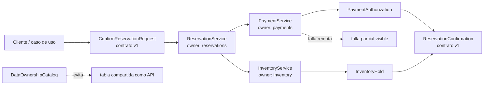

# 08. Microservicios

El servicio de reservas no lee tablas internas de pagos ni inventario. Colabora
mediante contratos explícitos y trata una falla remota como falla parcial
visible. El catálogo de ownership enseña que compartir tablas entre servicios
rompe autonomía aunque el código esté separado.
