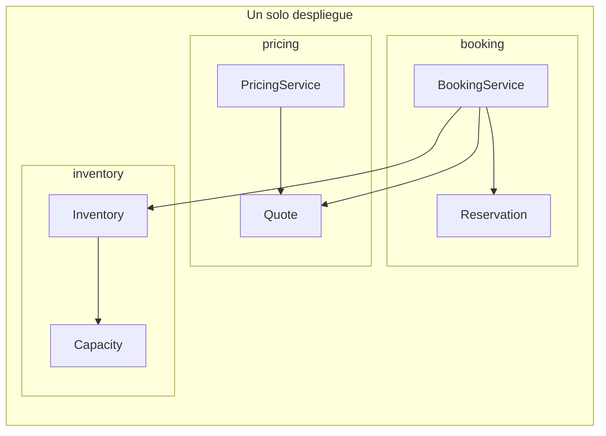

# 01. Monolito modular

| Campo | Valor |
|-------|-------|
| Estado | `draft` |
| Issue | [#5](https://github.com/jeresoftx/rust-software-architecture/issues/5), [#6](https://github.com/jeresoftx/rust-software-architecture/issues/6), [#7](https://github.com/jeresoftx/rust-software-architecture/issues/7), [#10](https://github.com/jeresoftx/rust-software-architecture/issues/10) |
| PR | Pendiente |
| Milestone | `01. Monolito modular` |
| Módulo Rust | `src/modular_monolith.rs` |
| Ejemplos | `examples/01_basico.rs`, `examples/01_intermedio.rs`, `examples/01_realista.rs` |
| Soluciones | `examples/soluciones/01_monolito_modular.rs` |
| Diagramas | `diagrams/01-monolito-modular.md` |

Un monolito modular es un sistema que se despliega como una sola unidad, pero
se diseña internamente como un conjunto de módulos con límites explícitos. La
palabra importante no es "monolito"; es "modular".

Este capítulo abre el curso porque enseña una idea incómoda pero esencial:
distribuir no crea buenos límites. Si el sistema no puede separar inventario,
cotización y reservas dentro de un solo proceso, separarlos en servicios solo
hará que el desorden viaje por la red.

## 1. Concepto

Un monolito modular conserva un solo binario, una sola liberación y, muchas
veces, una sola base de datos física. Aun así, el código no se organiza como una
masa compartida. Cada módulo declara:

- qué responsabilidad protege;
- qué tipos expone;
- qué operaciones acepta;
- qué invariantes conserva;
- qué detalles mantiene privados;
- qué contratos permite hacia otros módulos.

En Rust, esta idea se puede enseñar con herramientas simples: `mod`,
visibilidad, tipos públicos mínimos, constructores que validan estado y tests
cercanos al módulo.

Un monolito modular no es una etapa inmadura antes de microservicios. Puede ser
la arquitectura correcta durante mucho tiempo cuando el equipo necesita cambios
claros, despliegue sencillo y menor carga operativa.

## 2. Problema

El motor de reservas educativo tiene tres tensiones iniciales:

1. **Inventario:** decide si una oferta tiene capacidad disponible.
2. **Cotización:** calcula una propuesta temporal con precio y vigencia.
3. **Reservas:** confirma o cancela una intención del usuario.

Si estas responsabilidades se mezclan, aparecen síntomas conocidos:

- una reserva puede confirmarse sin haber verificado inventario;
- una cotización expirada puede reutilizarse por accidente;
- una regla de capacidad se copia en varios lugares;
- una consulta de disponibilidad modifica estado;
- un cambio pequeño exige tocar archivos que no comparten razón de cambio.

El problema no es que todo viva en un proceso. El problema es que todo puede
conocer todo.

## 3. Alternativas

### Monolito sin límites

Es el camino más rápido al inicio: funciones sueltas, tipos compartidos y acceso
directo a cualquier dato. Su costo aparece cuando una regla de negocio cambia y
no hay un lugar claro donde aplicarla.

### Capas técnicas

Separar `controllers`, `services` y `repositories` puede ordenar cierto ruido,
pero no siempre protege el lenguaje del negocio. Si todas las reglas terminan
en una capa genérica de servicios, inventario, cotización y reservas siguen
acoplados por accidente.

### Microservicios tempranos

Separar inventario, cotización y reservas en despliegues distintos parece dar
autonomía, pero introduce red, observabilidad, fallas parciales, versionado y
consistencia distribuida antes de haber entendido los límites internos.

### Monolito modular

Permite practicar límites de negocio sin pagar todavía el costo de distribución.
El despliegue sigue siendo simple, pero el código aprende a respetar contratos.

## 4. Modelo Rust esperado

El modelo mínimo representa tres módulos:

- `inventory`: administra capacidad de una oferta;
- `pricing`: construye cotizaciones válidas;
- `booking`: confirma reservas usando contratos explícitos.

El objetivo del código no es simular una agencia de viajes. El objetivo es
mostrar que un módulo puede colaborar con otro sin invadir sus detalles.

El modelo se implementa en `src/modular_monolith.rs` y se valida con pruebas que
cubren confirmación, rechazo de cotizaciones expiradas y rechazo de
sobrerreserva.

## 5. Invariantes

El capítulo debe proteger estas reglas:

- una oferta no puede quedar con capacidad negativa;
- una reserva confirmada ocupa exactamente una unidad de inventario;
- una cotización expirada no puede confirmarse;
- una reserva confirmada tiene un identificador estable;
- el módulo de reservas no modifica directamente los campos internos de
  inventario;
- una consulta de disponibilidad no cambia estado.

Estas invariantes deben convertirse en pruebas cuando se implemente el modelo
Rust mínimo.

## 6. Costos

El monolito modular agrega disciplina:

- hay que diseñar nombres y fronteras;
- la visibilidad pública debe mantenerse pequeña;
- algunas operaciones necesitan contratos internos explícitos;
- las pruebas deben validar reglas por módulo;
- el equipo debe resistir la tentación de compartir tipos "por comodidad".

Su beneficio principal es que evita pagar costos distribuidos antes de tiempo.
Su costo principal es cultural: exige respetar límites aunque el compilador no
pueda expresar todos los acuerdos arquitectónicos.

El análisis de costos vive también en
[`benches/01-monolito-modular-costos.md`](../benches/01-monolito-modular-costos.md).
Este capítulo no usa benchmark de throughput porque la decisión no se toma por
velocidad entre llamadas dentro del mismo proceso. El benchmark educativo es de
claridad: contratos internos pequeños, visibilidad mínima e invariantes
probadas.

## 7. Modos de falla

Un monolito modular falla cuando:

- los módulos son solo carpetas;
- todos los tipos son públicos;
- cada módulo importa detalles internos de los demás;
- la base de datos se convierte en el contrato real;
- los tests validan flujos felices, pero no invariantes;
- se usa la palabra "modular" para evitar discutir límites.

También falla cuando se presenta como respuesta universal. Si la organización
necesita despliegues independientes, aislamiento operacional fuerte o equipos
con ciclos de cambio muy distintos, el monolito modular puede dejar de ser
suficiente.

## 8. Relación con otros cursos

Este capítulo toma ideas de `rust-design-patterns` para encapsulación y
contratos, de `rust-system-design` para reconocer límites de sistema y prepara
el terreno para `rust-distributed-systems` y `rust-cloud`, donde distribuir un
sistema aumenta el costo de coordinación.

## 9. Diagrama Mermaid

El diagrama completo vive en
[`diagrams/01-monolito-modular.md`](../diagrams/01-monolito-modular.md).



La flecha importante no cruza una red. Cruza una frontera de módulo. `booking`
usa `Quote` e `Inventory` mediante APIs públicas pequeñas; no edita campos
internos ni decide cómo se guarda la capacidad.

## 10. Ejemplos progresivos

Los ejemplos están pensados para leerse y ejecutarse en orden:

| Nivel | Archivo | Qué enseña |
|-------|---------|------------|
| Básico | `examples/01_basico.rs` | Crear inventario y leer disponibilidad sin mutar estado |
| Intermedio | `examples/01_intermedio.rs` | Confirmar una reserva mediante contratos internos |
| Realista | `examples/01_realista.rs` | Rechazar una cotización expirada sin consumir inventario |

Ejecutarlos:

```bash
cargo run --example 01_basico
cargo run --example 01_intermedio
cargo run --example 01_realista
```

El ejemplo básico muestra el primer límite: consultar disponibilidad no cambia
estado. El ejemplo intermedio muestra colaboración entre módulos. El ejemplo
realista enseña que un fallo de reglas no debe dejar efectos secundarios
parciales.

## 11. Ejercicios

### Nivel 1: identificar límites

Lee `src/modular_monolith.rs` y responde:

1. ¿Qué módulo conserva la capacidad disponible?
2. ¿Qué módulo decide si una cotización expiró?
3. ¿Qué módulo coordina la confirmación de una reserva?
4. ¿Qué campos privados impiden mutaciones accidentales desde otros módulos?

La meta no es memorizar nombres. La meta es poder explicar por qué cada regla
vive donde vive.

### Nivel 2: agregar una regla pequeña

Agrega una prueba para rechazar una cotización con precio cero. Después ajusta
el código mínimo si hiciera falta.

Pistas:

- usa `Money::mxn(0)`;
- espera `ModularMonolithError::InvalidMoney`;
- la prueba debe fallar si el sistema acepta una cotización sin precio real.

### Nivel 3: defender una frontera

Propón una nueva operación `cancelar_reserva`. Antes de escribir código,
responde:

- ¿pertenece a `booking`, `inventory` o requiere colaboración entre ambos?
- ¿qué invariante protege?
- ¿qué contrato interno necesitarías?
- ¿qué costo agrega si el capítulo sigue siendo un monolito modular?
- ¿qué cambiaría si esto se separara en microservicios?

La respuesta aceptable debe nombrar tradeoffs, no solo dibujar otro módulo.

## Solución sugerida

La solución de referencia vive en
[`examples/soluciones/01_monolito_modular.rs`](../examples/soluciones/01_monolito_modular.rs).
También se compila como `examples/01_solucion.rs` para evitar que el material de
solución se vuelva código muerto.

Una buena solución conserva estas ideas:

- `booking` coordina la intención de confirmar;
- `pricing` produce una cotización válida con vigencia;
- `inventory` protege su propia capacidad;
- la reserva no se confirma si una regla previa falla;
- el flujo se puede probar sin base de datos, red ni framework.

Para el ejercicio de cancelación, una respuesta razonable es mantener la
operación en `booking` y pedir a `inventory` una operación interna explícita
para liberar capacidad. La trampa sería permitir que `booking` edite campos
internos de inventario "porque está en el mismo binario".

## 12. Cierre editorial

Estado actual: `draft`.

Este capítulo todavía no está `reviewed` ni `published`. Ya cuenta con modelo
Rust mínimo, diagrama, ejemplos progresivos, ejercicios, solución sugerida y
análisis de costos. Requiere revisión humana explícita de Joel antes de avanzar
a `reviewed` o `published`.

### Decisiones registradas

- El monolito modular se enseña antes de arquitectura hexagonal y microservicios
  porque primero hay que aprender a proteger límites dentro de un solo
  despliegue.
- El motor de reservas se divide inicialmente en inventario, cotización y
  reservas.
- El capítulo no presenta microservicios como evolución obligatoria.
- Este capítulo no usa benchmark de throughput; declara un benchmark educativo
  de claridad, límites e invariantes.
