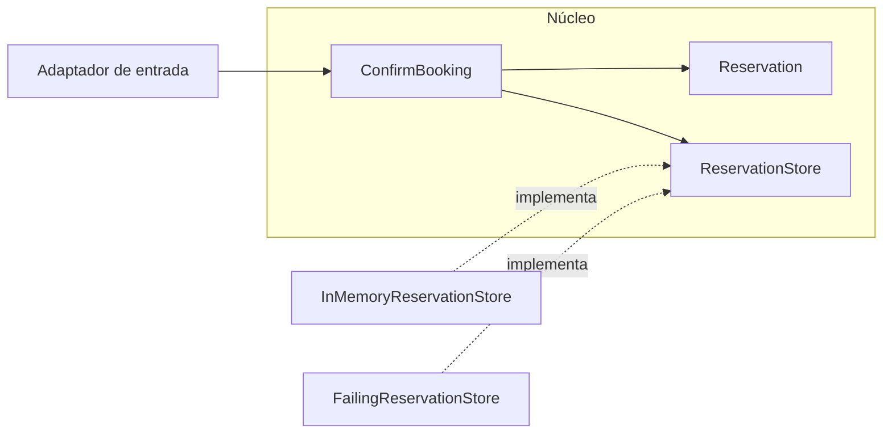

# 02. Arquitectura hexagonal

| Campo | Valor |
|-------|-------|
| Estado | `draft` |
| Issue | [#8](https://github.com/jeresoftx/rust-software-architecture/issues/8), [#9](https://github.com/jeresoftx/rust-software-architecture/issues/9), [#11](https://github.com/jeresoftx/rust-software-architecture/issues/11), [#12](https://github.com/jeresoftx/rust-software-architecture/issues/12) |
| PR | Pendiente |
| Milestone | `02. Arquitectura hexagonal` |
| Módulo Rust | `src/hexagonal_architecture.rs` |
| Ejemplos | `examples/02_basico.rs`, `examples/02_intermedio.rs`, `examples/02_realista.rs` |
| Soluciones | `examples/soluciones/02_arquitectura_hexagonal.rs` |
| Diagramas | `diagrams/02-arquitectura-hexagonal.md` |

La arquitectura hexagonal organiza el sistema alrededor de un núcleo de
aplicación protegido por puertos y adaptadores. El núcleo expresa reglas,
casos de uso e intenciones; los adaptadores conectan ese núcleo con detalles
externos como CLI, HTTP, memoria, archivos, bases de datos o proveedores.

La imagen útil no es un hexágono bonito. La idea importante es la dirección de
dependencia: el núcleo no debe saber qué tecnología lo está llamando ni dónde
se persiste su resultado.

## 1. Concepto

En un diseño hexagonal, el código se separa por frontera de intención:

- **Núcleo:** tipos y casos de uso que representan decisiones de negocio.
- **Puertos de entrada:** contratos para pedirle algo al sistema.
- **Puertos de salida:** contratos que el núcleo necesita para consultar o
  persistir información.
- **Adaptadores de entrada:** CLI, HTTP, jobs o pruebas que llaman al sistema.
- **Adaptadores de salida:** memoria, archivos, bases de datos o servicios
  externos que cumplen los puertos requeridos.

El núcleo no depende de los adaptadores. Los adaptadores dependen del núcleo.
Esto permite cambiar una forma de entrada o salida sin reescribir las reglas
principales.

## 2. Problema

Después del monolito modular, el motor de reservas ya tiene límites internos.
El siguiente dolor aparece cuando una regla de confirmación empieza a mezclarse
con detalles de infraestructura:

- confirmar una reserva necesita guardar estado;
- consultar una cotización necesita una fuente de datos;
- un flujo puede llegar desde CLI hoy y HTTP mañana;
- una prueba no debería levantar base de datos para validar una regla;
- un proveedor externo no debe contaminar el lenguaje del dominio.

Si el caso de uso conoce directamente una base de datos o un framework web, el
sistema queda atado a una decisión secundaria. El problema no es usar
infraestructura; el problema es dejar que la infraestructura dicte el diseño del
núcleo.

## 3. Alternativas

### Monolito modular solamente

Mantener módulos internos puede ser suficiente cuando el sistema no necesita
variar entradas o salidas. Su límite aparece cuando los detalles externos
empiezan a filtrarse en casos de uso.

### Capas técnicas tradicionales

Las capas pueden separar presentación, servicio y repositorio, pero a veces
terminan invirtiendo la conversación: el caso de uso se diseña alrededor de la
base de datos o el framework.

### Arquitectura hexagonal

La arquitectura hexagonal obliga a nombrar contratos. El caso de uso depende de
puertos que expresan intención, y los adaptadores implementan esos puertos con
tecnología concreta.

### Microservicios

Separar despliegues no resuelve la fuga de infraestructura. Un microservicio
también puede estar mal diseñado si su núcleo depende directamente del
framework, la base de datos o el proveedor externo.

## 4. Modelo Rust esperado

El modelo mínimo representa:

- un caso de uso `ConfirmBooking`;
- un puerto de salida para guardar reservas;
- un adaptador en memoria para pruebas y ejemplos;
- un adaptador de entrada pequeño que convierta datos externos en intención del
  caso de uso;
- errores explícitos cuando una entrada o dependencia no cumple el contrato.

El objetivo no es crear un framework hexagonal. El objetivo es que el estudiante
vea cómo una regla se prueba sin infraestructura real y cómo un adaptador puede
cambiar sin tocar el núcleo.

El modelo se implementa en `src/hexagonal_architecture.rs` y se valida con
pruebas que cubren confirmación mediante puerto de salida, rechazo de entradas
inválidas antes de tocar adaptadores y propagación de fallas del adaptador.

## 5. Invariantes

El capítulo debe proteger estas reglas:

- el caso de uso no depende de un adaptador concreto;
- un adaptador traduce detalles externos hacia lenguaje del núcleo;
- guardar una reserva ocurre mediante un puerto explícito;
- una entrada inválida se rechaza antes de tocar el puerto de salida;
- una falla del adaptador de salida no se oculta como éxito;
- las pruebas del caso de uso pueden ejecutarse con un adaptador en memoria.

Estas invariantes deben convertirse en pruebas durante la implementación del
modelo Rust mínimo.

## 6. Costos

La arquitectura hexagonal agrega nombres y contratos:

- más tipos para puertos y adaptadores;
- más decisiones sobre qué pertenece al núcleo;
- más pruebas de frontera;
- riesgo de crear interfaces sin necesidad real;
- disciplina para no filtrar detalles técnicos.

Su beneficio principal es hacer sustituible la infraestructura. Su costo
principal es la ceremonia cuando el problema todavía no exige esa sustitución.

El análisis de costos vive también en
[`benches/02-arquitectura-hexagonal-costos.md`](../benches/02-arquitectura-hexagonal-costos.md).
Este capítulo no usa benchmark de throughput porque el costo relevante no es la
velocidad de una llamada a trait, sino la claridad de la frontera y la capacidad
de sustituir infraestructura sin tocar el caso de uso.

## 7. Modos de falla

La arquitectura hexagonal falla cuando:

- cada función recibe un trait aunque no haya una frontera real;
- los puertos se nombran desde tecnología, no desde intención;
- el dominio termina hablando en términos de HTTP, SQL o JSON;
- los adaptadores contienen reglas que deberían vivir en el núcleo;
- las pruebas solo validan mocks y dejan de validar comportamiento;
- se confunde "muchas interfaces" con buena arquitectura.

## 8. Relación con otros cursos

Este capítulo se apoya en `rust-design-patterns` para traits y composición,
en `rust-database-internals` para entender que persistencia tiene costos reales
y en `rust-cloud` para recordar que un adaptador concreto puede cambiar por
decisiones operativas.

## 9. Diagrama Mermaid

El diagrama completo vive en
[`diagrams/02-arquitectura-hexagonal.md`](../diagrams/02-arquitectura-hexagonal.md).



El caso de uso depende del puerto `ReservationStore`. El adaptador en memoria y
el adaptador fallido implementan el puerto desde afuera. Esa dirección permite
probar el núcleo sin base de datos real y cambiar infraestructura sin reescribir
la regla de confirmación.

## 10. Ejemplos progresivos

Los ejemplos están pensados para leerse y ejecutarse en orden:

| Nivel | Archivo | Qué enseña |
|-------|---------|------------|
| Básico | `examples/02_basico.rs` | Confirmar una reserva usando un adaptador en memoria |
| Intermedio | `examples/02_intermedio.rs` | Rechazar entrada inválida antes de tocar el adaptador |
| Realista | `examples/02_realista.rs` | Propagar una falla de infraestructura como error del puerto |

Ejecutarlos:

```bash
cargo run --example 02_basico
cargo run --example 02_intermedio
cargo run --example 02_realista
```

El ejemplo básico muestra el flujo feliz. El intermedio muestra que el adaptador
no debe recibir datos inválidos. El realista muestra que una falla de salida no
debe ocultarse como éxito del caso de uso.

## 11. Ejercicios

### Nivel 1: ubicar puertos y adaptadores

Lee `src/hexagonal_architecture.rs` y responde:

1. ¿Qué módulo contiene el dominio?
2. ¿Qué trait funciona como puerto de salida?
3. ¿Qué tipo representa el caso de uso?
4. ¿Qué adaptadores implementan el puerto?
5. ¿Dónde se rechaza una entrada inválida antes de tocar infraestructura?

La meta es reconocer la dirección de dependencia, no repetir el dibujo del
hexágono.

### Nivel 2: crear otro adaptador

Crea un adaptador `CountingReservationStore` que implemente `ReservationStore` y
solo cuente cuántas reservas se intentaron guardar. Después úsalo en una prueba
del caso de uso.

Pistas:

- el adaptador debe vivir fuera del caso de uso;
- el caso de uso no debe cambiar;
- la prueba debe demostrar que una entrada inválida no incrementa el contador.

### Nivel 3: defender un puerto

Imagina que ahora la confirmación debe publicar un evento `ReservaConfirmada`.
Antes de escribir código, responde:

- ¿conviene agregar otro puerto de salida?
- ¿debe el caso de uso guardar y publicar en la misma operación?
- ¿qué pasa si guardar funciona pero publicar falla?
- ¿qué costo introduce ocultar esa falla?
- ¿en qué momento esta discusión se vuelve tema de arquitectura orientada a
  eventos?

Una buena respuesta nombra límites transaccionales, errores visibles y costo
operativo. No basta decir "agregaría un EventPublisher".

## Solución sugerida

La solución de referencia vive en
[`examples/soluciones/02_arquitectura_hexagonal.rs`](../examples/soluciones/02_arquitectura_hexagonal.rs).
También se compila como `examples/02_solucion.rs`.

Una buena solución conserva estas ideas:

- el caso de uso `ConfirmBooking` no cambia;
- el nuevo adaptador implementa `ReservationStore`;
- el adaptador puede agregar auditoría sin contaminar el dominio;
- el núcleo sigue hablando de reservas, no de logs, HTTP, SQL o archivos.

Para el ejercicio del evento, una respuesta razonable es reconocer que publicar
un evento probablemente necesita otro puerto de salida, pero que el capítulo no
debe resolver todavía consistencia entre persistencia y publicación. Esa tensión
se estudiará con más detalle en arquitectura orientada a eventos y event
sourcing.

## 12. Cierre editorial

Estado actual: `draft`.

Este capítulo todavía no está `reviewed` ni `published`. Ya cuenta con modelo
Rust mínimo, diagrama, ejemplos progresivos, ejercicios, solución sugerida y
análisis de costos. Requiere revisión humana explícita de Joel antes de avanzar
a `reviewed` o `published`.

### Decisiones registradas

- La arquitectura hexagonal se enseña después del monolito modular porque
  primero se necesitan límites internos y después fronteras contra
  infraestructura.
- El capítulo se centra en puertos y adaptadores como contratos de intención,
  no como interfaces decorativas.
- El núcleo no debe depender de adaptadores concretos.
- Este capítulo no usa benchmark de throughput; declara un benchmark educativo
  de sustitución de infraestructura, claridad de frontera y errores visibles.
