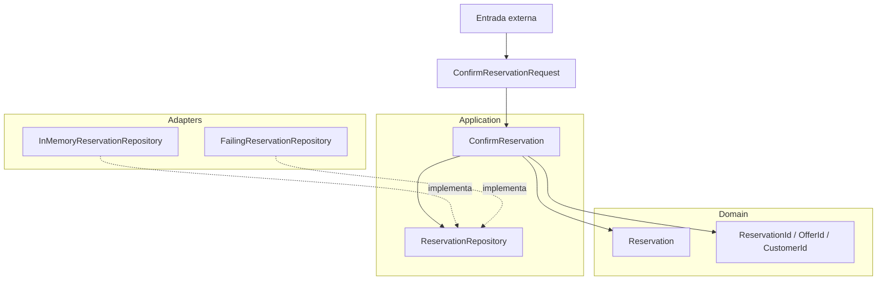

# 03. Clean Architecture

| Campo | Valor |
|-------|-------|
| Estado | `draft` |
| Issue | [#18](https://github.com/jeresoftx/rust-software-architecture/issues/18), [#20](https://github.com/jeresoftx/rust-software-architecture/issues/20), [#15](https://github.com/jeresoftx/rust-software-architecture/issues/15) |
| PR | Pendiente |
| Milestone | `03. Clean Architecture` |
| Módulo Rust | `src/clean_architecture.rs` |
| Ejemplos | `examples/03_basico.rs`, `examples/03_intermedio.rs`, `examples/03_realista.rs` |
| Soluciones | Pendiente |
| Diagramas | `diagrams/03-clean-architecture.md` |

Clean Architecture organiza el software por dirección de dependencia: las
reglas estables viven al centro y los detalles cambiantes viven afuera. El
objetivo no es dibujar círculos; es impedir que frameworks, bases de datos,
transporte o formatos externos dicten la forma de las reglas de negocio.

En este curso, Clean Architecture aparece después de arquitectura hexagonal
porque ya existe la intuición de puertos y adaptadores. Ahora se vuelve más
explícita la separación entre entidades, casos de uso, interfaces y detalles.

## 1. Concepto

Clean Architecture propone que el código más estable no dependa del código más
volátil. En una lectura práctica:

- **Entidades:** reglas de negocio puras y objetos con invariantes.
- **Casos de uso:** orquestación de intenciones de aplicación.
- **Interfaces:** contratos para entrar o salir del núcleo.
- **Adaptadores:** traducción entre contratos y detalles técnicos.
- **Detalles:** frameworks, almacenamiento, transporte, UI, proveedores.

La regla central es la dependencia hacia adentro: una entidad no sabe que existe
un caso de uso; un caso de uso no sabe qué base de datos se usa; un adaptador sí
puede conocer el caso de uso para invocarlo o implementar un contrato.

## 2. Problema

El motor de reservas ya puede confirmar una reserva mediante puertos y
adaptadores. El siguiente dolor aparece cuando el caso de uso empieza a cargar
demasiadas responsabilidades:

- valida identificadores;
- decide estado de reserva;
- traduce errores externos;
- coordina persistencia;
- conoce detalles de entrada;
- mezcla reglas de entidad con reglas de aplicación.

Cuando todo vive en el caso de uso, los tests siguen pasando, pero el diseño se
vuelve frágil. Cambiar una regla de entidad obliga a tocar orquestación. Cambiar
un adaptador obliga a revisar reglas internas. La frontera existe, pero no está
ordenada por estabilidad.

## 3. Alternativas

### Mantener solo arquitectura hexagonal

Puede bastar si el núcleo es pequeño. El riesgo aparece cuando el puerto y el
caso de uso se vuelven el lugar donde cae toda regla. La frontera contra
infraestructura existe, pero la frontera interna todavía puede ser débil.

### Capas técnicas

Separar `controllers`, `services` y `repositories` ordena por tecnología, pero
no necesariamente por estabilidad. Una capa de servicios puede convertirse en
un bloque grande que sabe demasiado.

### Clean Architecture

Ordena el núcleo por políticas internas. Las entidades protegen invariantes, los
casos de uso coordinan intención, las interfaces traducen contratos y los
detalles quedan afuera.

### DDD completo

Domain-Driven Design profundiza lenguaje ubicuo, agregados y bounded contexts.
Clean Architecture prepara esa discusión, pero todavía no exige modelar todo el
lenguaje de negocio como DDD.

## 4. Modelo Rust esperado

El modelo mínimo debe representar:

- una entidad `Reservation` con reglas propias;
- un caso de uso `ConfirmReservation`;
- un puerto de salida para persistir reservas;
- una frontera de entrada que convierte datos primitivos en intención;
- errores separados entre validación, regla de entidad y persistencia;
- pruebas que demuestren que las entidades no dependen de adaptadores.

El objetivo no es crear carpetas ceremoniales. El objetivo es que el lector vea
qué cambia cuando la regla de negocio baja a una entidad y el caso de uso deja
de ser un contenedor de todo.

El modelo se implementa en `src/clean_architecture.rs` y se valida con pruebas
que cubren confirmación exitosa, rechazo de entrada inválida antes de tocar
persistencia y propagación explícita de una falla de repositorio.

## 5. Invariantes

El capítulo debe proteger estas reglas:

- una reserva no puede confirmarse sin identificador válido;
- una reserva confirmada conserva estado explícito;
- el caso de uso orquesta, pero no decide todos los detalles de entidad;
- las entidades no dependen de puertos, adaptadores ni frameworks;
- una falla de persistencia no se oculta como confirmación exitosa;
- una entrada inválida no llega a persistencia.

Estas invariantes deben convertirse en pruebas durante la implementación del
modelo Rust mínimo.

Las primeras pruebas del capítulo ya protegen tres fronteras: la entidad
mantiene estado confirmado explícito, el caso de uso transforma datos primitivos
en intención válida y el repositorio queda detrás de un contrato que el núcleo
puede usar sin conocer el adaptador concreto.

## 6. Costos

Clean Architecture agrega capas conceptuales:

- más nombres para ubicar responsabilidades;
- más archivos o módulos cuando el ejemplo crece;
- más decisiones sobre dónde vive una regla;
- riesgo de convertir cada idea en una abstracción;
- necesidad de revisar dependencias, no solo comportamiento.

Su beneficio principal es proteger reglas estables de detalles cambiantes. Su
costo principal es la ceremonia cuando el sistema todavía no tiene suficiente
complejidad para necesitarla.

## 7. Modos de falla

Clean Architecture falla cuando:

- las entidades son anémicas y todas las reglas viven en servicios;
- cada capa solo pasa datos hacia la siguiente;
- se crean interfaces para todo sin razón de cambio real;
- el caso de uso depende de detalles de framework;
- el diagrama se vuelve más importante que el flujo;
- se usa para presumir arquitectura en vez de reducir acoplamiento.

## 8. Relación con otros cursos

Este capítulo se apoya en `rust-design-patterns` para composición y
encapsulación, en `rust-system-design` para reconocer estabilidad de decisiones
y prepara el camino hacia `rust-domain-driven-design`, donde el lenguaje de
negocio se vuelve más profundo.

## 9. Diagrama Mermaid

El diagrama completo vive en
[`diagrams/03-clean-architecture.md`](../diagrams/03-clean-architecture.md).



La línea punteada muestra implementación de contrato desde afuera. El caso de
uso conoce el contrato `ReservationRepository`, pero no conoce si la
persistencia vive en memoria, en una base de datos o en un proveedor remoto. La
entidad `Reservation` tampoco conoce el caso de uso ni el repositorio.

## 10. Ejemplos progresivos

Los ejemplos están pensados para leerse y ejecutarse en orden:

| Nivel | Archivo | Qué enseña |
|-------|---------|------------|
| Básico | `examples/03_basico.rs` | Confirmar una reserva desde un caso de uso limpio |
| Intermedio | `examples/03_intermedio.rs` | Rechazar entrada inválida antes de tocar repositorio |
| Realista | `examples/03_realista.rs` | Propagar una falla de repositorio sin ocultarla |

Ejecutarlos:

```bash
cargo run --example 03_basico
cargo run --example 03_intermedio
cargo run --example 03_realista
```

El ejemplo básico muestra la ruta feliz. El intermedio muestra que la frontera
de entrada convierte datos primitivos en tipos válidos antes de persistir. El
realista muestra que Clean Architecture no promete ausencia de fallas; promete
que las fallas cruzan las capas como decisiones explícitas.

## 11. Ejercicios

Pendientes del issue de ejercicios, soluciones y costos.

## 12. Cierre editorial

Estado actual: `draft`.

Este capítulo todavía no está `reviewed` ni `published`. Requiere ejercicios,
soluciones, costos finales y revisión humana explícita de Joel antes de avanzar
de estado editorial.

### Decisiones registradas

- Clean Architecture se enseña después de arquitectura hexagonal porque primero
  se entiende la frontera contra infraestructura y luego la dirección interna de
  dependencias.
- El capítulo no presenta capas como ceremonia; las usa para proteger reglas
  estables.
- Las entidades no deben depender de casos de uso, puertos ni adaptadores.
