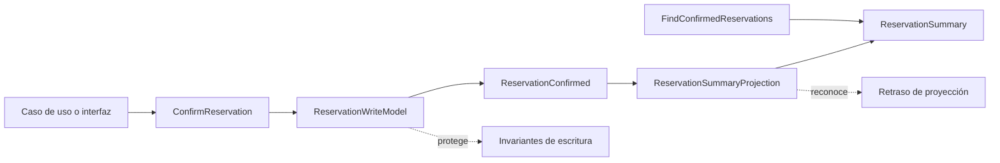

# 05. CQRS

| Campo | Valor |
|-------|-------|
| Estado | `draft` |
| Issue | [#21](https://github.com/jeresoftx/rust-software-architecture/issues/21), [#28](https://github.com/jeresoftx/rust-software-architecture/issues/28), [#27](https://github.com/jeresoftx/rust-software-architecture/issues/27), [#26](https://github.com/jeresoftx/rust-software-architecture/issues/26) |
| PR | Pendiente |
| Milestone | `05. CQRS` |
| Módulo Rust | `src/cqrs.rs` |
| Ejemplos | `examples/05_basico.rs`, `examples/05_intermedio.rs`, `examples/05_realista.rs` |
| Soluciones | `examples/soluciones/05_cqrs.rs`, `examples/05_solucion.rs` |
| Diagramas | `diagrams/05-cqrs.md` |

CQRS separa dos preguntas que a menudo se mezclan por comodidad: ¿qué cambia el
sistema? y ¿qué necesita leer una persona, API o proceso? No es una excusa para
duplicar todo. Es una forma de aceptar que escribir reglas y leer vistas útiles
pueden tener modelos, ritmos y costos distintos.

En el motor de reservas educativo, confirmar una reserva protege invariantes de
negocio; consultar disponibilidad, historial o tableros de operación puede
necesitar datos reorganizados para lectura. CQRS aparece cuando esa diferencia
deja de ser accidental.

## 1. Concepto

CQRS significa Command Query Responsibility Segregation. La idea central es
separar responsabilidades:

- **Comandos:** expresan intención de cambiar estado.
- **Modelo de escritura:** protege invariantes y decide si un cambio es válido.
- **Eventos o resultados:** comunican que algo cambió o que el comando falló.
- **Proyecciones:** construyen vistas optimizadas para lectura.
- **Consultas:** leen esas vistas sin modificar estado.

La separación no obliga a usar dos bases de datos, colas ni microservicios. El
punto pedagógico es más pequeño: un comando no debe fingir ser consulta, y una
consulta no debe mutar el sistema por accidente.

## 2. Problema

Después de DDD, el curso ya tiene agregados y eventos de dominio. El siguiente
dolor aparece cuando una misma estructura intenta servir a dos fuerzas
distintas:

- confirmar una reserva requiere validar transición, cliente, oferta y precio;
- consultar reservas confirmadas quiere una lista rápida y directa;
- un tablero necesita conteos por estado;
- una pantalla de atención quiere datos ya formateados para búsqueda;
- optimizar lectura puede tentar a romper el agregado de escritura.

Si el mismo modelo intenta proteger invariantes y responder todas las consultas,
termina siendo incómodo para ambas cosas. El agregado se llena de campos de UI,
o la consulta empieza a saltarse reglas de escritura para ser rápida.

## 3. Alternativas

### Mantener un solo modelo

Es lo más simple y debe ser la decisión inicial cuando el sistema todavía no
tiene presión real de lectura. Su costo aparece cuando cada consulta obliga a
deformar el modelo de escritura.

### Repositorios con métodos de consulta

Puede funcionar para casos pequeños. El riesgo es que el repositorio empiece a
mezclar intención de dominio con reportes, filtros, búsquedas y formatos de
pantalla.

### CQRS dentro del mismo proceso

Se separan comandos, consultas y proyecciones sin distribuir el sistema. Es la
opción educativa de este capítulo porque muestra el límite sin esconderlo detrás
de infraestructura.

### CQRS distribuido

Comandos y consultas pueden vivir en procesos o almacenes distintos. Eso abre
temas de consistencia eventual, retraso de proyecciones, reintentos y
observabilidad. Este curso lo nombra, pero no lo convierte en requisito para el
primer modelo.

## 4. Modelo Rust esperado

El modelo mínimo debe representar:

- un comando `ConfirmReservation`;
- un modelo de escritura que confirme una reserva y produzca un evento;
- una proyección `ReservationSummaryProjection`;
- una consulta `FindConfirmedReservations`;
- una vista de lectura `ReservationSummary`;
- errores explícitos para comando inválido;
- pruebas que demuestren separación entre escribir y leer.

El objetivo no es crear una plataforma CQRS. El objetivo es que el lector vea
cómo una decisión de escritura puede alimentar una vista de lectura sin que la
consulta se apropie de las reglas del comando.

El modelo se implementa en `src/cqrs.rs` y se valida con pruebas que cubren
comando válido, comando inválido sin mutar escritura, proyección de eventos a
modelo de lectura y consulta que no modifica la proyección.

## 5. Invariantes

El capítulo debe proteger estas reglas:

- un comando inválido no cambia el modelo de escritura;
- confirmar una reserva produce un hecho observable;
- una proyección se actualiza a partir de hechos, no inventa cambios;
- una consulta no modifica estado;
- el modelo de lectura puede estar optimizado para leer sin volverse dueño de
  reglas de escritura;
- una proyección atrasada debe reconocerse como lectura potencialmente
  desactualizada, no como verdad absoluta.

Estas invariantes deben convertirse en pruebas durante la implementación del
modelo Rust mínimo.

Las primeras pruebas del capítulo ya protegen tres fronteras: el comando es la
única entrada de escritura, la proyección deriva su estado de hechos
confirmados y la consulta devuelve una copia de lectura sin modificar la vista.

## 6. Costos

CQRS agrega costo:

- más tipos para comandos, eventos, proyecciones y consultas;
- más pruebas para separar escritura y lectura;
- riesgo de duplicar modelos sin presión real;
- consistencia eventual cuando la proyección se actualiza después;
- más observabilidad para saber qué tan atrasada está una vista;
- más decisiones sobre qué datos pertenecen a escritura y cuáles a lectura.

Su beneficio principal es permitir que escritura y lectura evolucionen con
modelos distintos. Su costo principal es que introduce sincronización y
duplicación deliberada.

El análisis de costos vive también como nota educativa en
`benches/05-cqrs-costos.md`. Este capítulo no usa `cargo bench` porque medir la
velocidad de crear structs no enseña la decisión arquitectónica; lo importante
es medir claridad, duplicación, consistencia y observabilidad.

## 7. Modos de falla

CQRS falla cuando:

- se aplica antes de tener tensión real de lectura;
- se usa para justificar dos bases de datos sin necesidad;
- los comandos regresan vistas complejas y vuelven a mezclar responsabilidades;
- las consultas mutan estado;
- las proyecciones inventan hechos que no salieron del modelo de escritura;
- nadie monitorea retraso o reconstrucción de proyecciones;
- se confunde CQRS con event sourcing.

## 8. Relación con otros cursos

Este capítulo se apoya en `rust-domain-driven-design` para agregados y eventos,
en `rust-database-internals` para entender índices y modelos de lectura, en
`rust-system-design` para decidir cuándo separar modelos, y prepara el camino
hacia event sourcing, donde los eventos dejan de ser solo mensajes internos y
se vuelven la fuente histórica del estado.

## 9. Diagrama Mermaid

El flujo mínimo del capítulo se resume así:



La flecha importante no es infraestructura: es responsabilidad. El comando
entra por el lado de escritura, el modelo de escritura decide si puede aceptar
la intención, el evento comunica el hecho y la proyección prepara una vista
útil para lectura. La consulta no vuelve a confirmar la reserva; solo lee una
vista ya construida.

El diagrama editable vive en `diagrams/05-cqrs.md`.

## 10. Ejemplos progresivos

Los ejemplos avanzan de menor a mayor presión arquitectónica:

| Archivo | Enfoque | Qué observar |
|---------|---------|--------------|
| `examples/05_basico.rs` | Comando y modelo de escritura | Confirmar una reserva produce un evento y cambia solo el lado de escritura. |
| `examples/05_intermedio.rs` | Comando inválido | Un comando incompleto falla sin mutar el modelo de escritura. |
| `examples/05_realista.rs` | Proyección y consulta | El evento alimenta la vista de lectura, y la consulta obtiene datos sin mutar la proyección. |

Ejecución sugerida:

```bash
cargo run --example 05_basico
cargo run --example 05_intermedio
cargo run --example 05_realista
```

El punto de los ejemplos no es simular una arquitectura distribuida. El punto
es ver la frontera en un mismo proceso, con tipos pequeños y verificables.

## 11. Ejercicios

### Nivel 1: reconocer comandos y consultas

Lee `src/cqrs.rs` y responde:

1. ¿Qué tipo representa la intención de cambiar estado?
2. ¿Qué tipo protege el lado de escritura?
3. ¿Qué tipo comunica el hecho que ya ocurrió?
4. ¿Qué tipo construye la vista de lectura?
5. ¿Qué tipo consulta sin mutar la proyección?

La meta es distinguir responsabilidad, no memorizar nombres. Una respuesta
buena explica por qué `ConfirmReservation` no debe leer reportes y por qué
`FindConfirmedReservations` no debe confirmar reservas.

### Nivel 2: filtrar una vista de lectura

Usa `FindConfirmedReservations` para obtener resúmenes y crea una función
pequeña que filtre las reservas de un cliente específico. No cambies
`ReservationWriteModel` para resolver este ejercicio.

Pistas:

- la consulta devuelve `ReservationSummary`;
- `ReservationSummary` expone `customer_id()`;
- el filtro pertenece al lado de lectura;
- el modelo de escritura no debe enterarse del formato del reporte.

### Nivel 3: explicar retraso de proyección

Imagina que el modelo de escritura confirmó dos reservas, pero la proyección
solo ha aplicado el primer evento. Antes de escribir más código, responde:

- ¿qué puede prometer la API de lectura en ese instante?
- ¿qué no debe prometer?
- ¿cómo mostrarías el retraso a un operador o a otra API?
- ¿qué métrica observarías antes de separar procesos o bases de datos?
- ¿cuándo aceptarías consistencia eventual y cuándo la rechazarías?

Una buena respuesta habla de expectativas de lectura, no solo de tecnología.
CQRS no elimina la consistencia; la vuelve una decisión explícita.

## Solución sugerida

La solución de referencia vive en
[`examples/soluciones/05_cqrs.rs`](../examples/soluciones/05_cqrs.rs). También
se compila como `examples/05_solucion.rs`.

Una buena solución conserva estas ideas:

- el comando confirma reservas solo por el lado de escritura;
- los eventos son el puente hacia la proyección;
- el filtro por cliente opera sobre resúmenes de lectura;
- el retraso de proyección se nombra de forma explícita;
- la consulta no muta la proyección ni vuelve a ejecutar reglas de negocio.

Ejecutar la solución:

```bash
cargo run --example 05_solucion
```

## 12. Cierre editorial

Estado actual: `draft`.

Este capítulo todavía no está `reviewed` ni `published`. Ya cuenta con
especificación conceptual, modelo Rust mínimo, diagrama, ejemplos progresivos,
ejercicios, solución sugerida y análisis de costos. Requiere revisión humana
explícita de Joel antes de avanzar de estado editorial.

### Decisiones registradas

- CQRS se enseña después de DDD porque primero se necesita un modelo de escritura
  con lenguaje e invariantes.
- Este capítulo usa CQRS dentro del mismo proceso para enseñar el límite sin
  introducir infraestructura distribuida.
- CQRS no se presenta como sinónimo de event sourcing.
- Las proyecciones deben derivarse de hechos del modelo de escritura, no de
  deseos de la pantalla.
- Los ejemplos progresivos deben poder ejecutarse sin infraestructura externa.
- Este capítulo usa benchmark conceptual porque el costo relevante de CQRS es
  arquitectónico: duplicación, retraso de proyección y observabilidad.
