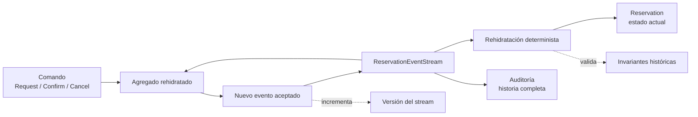

# 06. Event sourcing

| Campo | Valor |
|-------|-------|
| Estado | `draft` |
| Issue | [#23](https://github.com/jeresoftx/rust-software-architecture/issues/23), [#24](https://github.com/jeresoftx/rust-software-architecture/issues/24), [#25](https://github.com/jeresoftx/rust-software-architecture/issues/25) |
| PR | Pendiente |
| Milestone | `06. Event sourcing` |
| Módulo Rust | `src/event_sourcing.rs` |
| Ejemplos | `examples/06_basico.rs`, `examples/06_intermedio.rs`, `examples/06_realista.rs` |
| Soluciones | Pendiente |
| Diagramas | `diagrams/06-event-sourcing.md` |

Event sourcing cambia la pregunta central del modelo de persistencia. En vez de
guardar solamente el estado actual, guarda los hechos que llevaron al sistema a
ese estado. El estado deja de ser una foto aislada y se vuelve una lectura
reconstruida desde una historia.

En el motor de reservas educativo, una reserva no "aparece confirmada" por
magia. Primero fue solicitada, luego confirmada, quizá cancelada o rechazada.
Event sourcing enseña a conservar esa historia como fuente de verdad cuando el
historial importa tanto como el resultado.

## 1. Concepto

Event sourcing persiste eventos de dominio como fuente principal del estado. Un
evento representa algo que ya ocurrió y que el sistema decidió aceptar:

- `ReservationRequested`;
- `ReservationConfirmed`;
- `ReservationCancelled`.

Los eventos se guardan en un stream ordenado. Para obtener el estado actual, el
sistema rehidrata el agregado aplicando los eventos en orden. La auditoría deja
de ser un registro secundario y se vuelve parte natural del modelo: se puede
explicar cómo se llegó al estado actual.

Event sourcing no significa "usar eventos para todo". Tampoco significa CQRS
por obligación. CQRS separa escritura y lectura; event sourcing decide cómo se
guarda la verdad de escritura.

## 2. Problema

Después de CQRS, el curso ya separa comandos y consultas. El siguiente dolor
aparece cuando guardar solo el estado actual oculta preguntas importantes:

- ¿quién solicitó la reserva y cuándo?
- ¿la reserva fue confirmada directamente o después de un reintento?
- ¿qué evento explica que una reserva ya no pueda confirmarse?
- ¿cómo reconstruir una proyección si cambió la vista de lectura?
- ¿cómo auditar una decisión sin inventar logs paralelos al dominio?

Si solo se guarda `status = Confirmed`, se pierde la historia. Se puede agregar
una tabla de auditoría, pero entonces el sistema mantiene dos relatos: el estado
real y una bitácora que puede quedar incompleta. Event sourcing evita esa doble
verdad al hacer que la historia aceptada sea la fuente del estado.

## 3. Alternativas

### Estado actual persistido

Es la opción más simple y debe ser la predeterminada cuando el historial no
importa. Su costo aparece cuando se necesitan auditoría, reconstrucción o
explicación de decisiones pasadas.

### Estado actual más tabla de auditoría

Permite registrar cambios sin reconstruir el sistema. El riesgo es que la
auditoría se vuelva una sombra incompleta del dominio: registra que algo cambió,
pero no siempre por qué fue válido.

### Eventos como integración

Un sistema puede publicar eventos para otros sistemas y aun así guardar solo
estado actual. Eso es arquitectura orientada a eventos, no necesariamente event
sourcing.

### Event sourcing

Los eventos aceptados son el registro canónico. El estado actual se rehidrata
desde el stream. Esta opción gana cuando el valor de conservar historia supera
el costo de versionar eventos, reconstruir estado y manejar streams.

## 4. Modelo Rust esperado

El modelo mínimo debe representar:

- eventos de reserva versionables;
- un stream ordenado de eventos;
- un agregado `Reservation` que se rehidrata desde eventos;
- comandos que producen nuevos eventos válidos;
- errores explícitos para streams inválidos o transiciones imposibles;
- pruebas que demuestren rehidratación, auditoría y rechazo de historia
  inválida.

El objetivo no es crear un event store productivo. El objetivo es que el lector
vea que el estado actual puede derivarse de hechos, y que esos hechos tienen
orden, significado e invariantes.

El modelo se implementa en `src/event_sourcing.rs` y se valida con pruebas que
cubren append-only events, rehidratación determinista, rechazo de confirmación
sin solicitud previa e historia de auditoría conservada en orden.

## 5. Invariantes

El capítulo debe proteger estas reglas:

- un stream se aplica en orden;
- un evento aceptado no se edita para corregir el presente;
- rehidratar desde el mismo stream produce el mismo estado;
- una reserva no se confirma si no fue solicitada;
- una reserva cancelada no se confirma otra vez;
- un comando válido produce eventos nuevos, no mutaciones invisibles;
- una historia inválida debe fallar de forma explícita;
- las proyecciones pueden reconstruirse desde el stream, pero no inventan
  eventos.

Estas invariantes preparan el puente hacia arquitectura orientada a eventos:
primero se entiende la historia interna; después se decide qué hechos pueden
salir como contratos entre sistemas.

## 6. Costos

Event sourcing agrega costo:

- más disciplina para nombrar eventos como hechos;
- versionado de eventos cuando cambia el significado;
- migración o adaptación de streams antiguos;
- almacenamiento creciente;
- rehidratación y snapshots cuando los streams crecen;
- depuración de historias inválidas;
- mayor cuidado para no filtrar eventos internos como contratos públicos.

Su beneficio principal es que la historia se vuelve consultable, reconstruible
y auditable. Su costo principal es que obliga a diseñar el tiempo como parte
del dominio.

## 7. Modos de falla

Event sourcing falla cuando:

- se guardan eventos técnicos que no significan nada para el dominio;
- se cambia el significado de eventos pasados sin versionarlos;
- se confunde evento aceptado con comando solicitado;
- se permite editar streams para arreglar errores sin registrar compensación;
- se reconstruyen agregados desde eventos incompletos;
- se usa como moda cuando guardar estado actual bastaba;
- se publican eventos internos como contratos externos sin diseño explícito.

## 8. Relación con otros cursos

Este capítulo se apoya en `rust-domain-driven-design` para eventos de dominio y
agregados, en `rust-database-internals` para entender logs, almacenamiento y
recuperación, en `rust-distributed-systems` para pensar orden y fallas, y en
`rust-system-design` para decidir cuándo la auditoría y la reconstrucción
justifican el costo.

También conecta con `rust-docker` cuando se monten laboratorios de event stores
o motores de mensajería en cursos posteriores. En este repositorio, el modelo
se mantiene en memoria para enseñar la idea sin esconderla detrás de
infraestructura.

## 9. Diagrama Mermaid

El flujo mínimo del capítulo se resume así:



El stream guarda hechos aceptados en orden. El agregado se rehidrata desde esa
historia antes de decidir si un comando puede producir un nuevo evento. La
auditoría no es una tabla secundaria: es la misma historia que permite explicar
el estado actual.

El diagrama editable vive en `diagrams/06-event-sourcing.md`.

## 10. Ejemplos progresivos

Los ejemplos avanzan de menor a mayor presión histórica:

| Archivo | Enfoque | Qué observar |
|---------|---------|--------------|
| `examples/06_basico.rs` | Historia feliz | Solicitar y confirmar producen dos eventos; el estado se reconstruye desde el stream. |
| `examples/06_intermedio.rs` | Historia inválida | Confirmar sin solicitud previa no agrega eventos al stream. |
| `examples/06_realista.rs` | Auditoría | Cancelar conserva la historia completa y permite reconstruir estado final. |

Ejecución sugerida:

```bash
cargo run --example 06_basico
cargo run --example 06_intermedio
cargo run --example 06_realista
```

El punto de los ejemplos no es simular una base de datos de eventos. El punto
es ver que la historia aceptada es suficiente para explicar el estado actual.

## 11. Ejercicios

Pendientes del issue de ejercicios, soluciones y costos.

## 12. Cierre editorial

Estado actual: `draft`.

Este capítulo todavía no está `reviewed` ni `published`. Requiere ejercicios,
soluciones, costos finales y revisión humana explícita de Joel antes de avanzar
de estado editorial.

### Decisiones registradas

- Event sourcing se enseña después de CQRS para distinguir guardar historia de
  separar lectura y escritura.
- Este capítulo usa un event store en memoria para enseñar stream,
  rehidratación e invariantes sin infraestructura externa.
- Los eventos se nombran como hechos aceptados, no como solicitudes ni comandos.
- La historia del agregado es parte del dominio; no se trata como log técnico
  secundario.
- El modelo Rust mínimo protege rehidratación determinista y stream append-only
  sin `unsafe` ni dependencias externas.
- Los ejemplos progresivos deben demostrar historia feliz, historia inválida y
  auditoría sin infraestructura externa.
