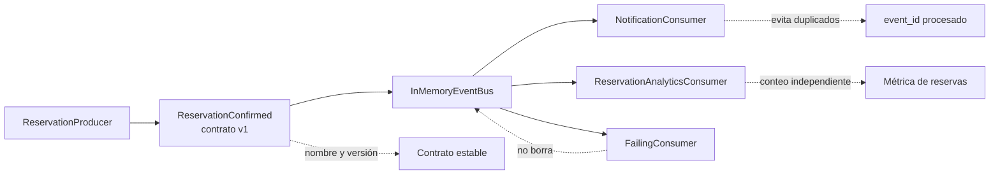

# 07. Arquitectura orientada a eventos

| Campo | Valor |
|-------|-------|
| Estado | `draft` |
| Issue | [#33](https://github.com/jeresoftx/rust-software-architecture/issues/33), [#32](https://github.com/jeresoftx/rust-software-architecture/issues/32), [#30](https://github.com/jeresoftx/rust-software-architecture/issues/30) |
| PR | Pendiente |
| Milestone | `07. Arquitectura orientada a eventos` |
| Módulo Rust | `src/event_driven_architecture.rs` |
| Ejemplos | `examples/07_basico.rs`, `examples/07_intermedio.rs`, `examples/07_realista.rs` |
| Soluciones | Pendiente |
| Diagramas | `diagrams/07-arquitectura-orientada-a-eventos.md` |

La arquitectura orientada a eventos organiza la integración alrededor de hechos
que otras partes del sistema pueden observar. Un productor publica que algo
ocurrió; uno o más consumidores reaccionan sin que el productor tenga que
conocerlos directamente.

En el motor de reservas educativo, confirmar una reserva puede interesarle a
facturación, notificaciones, analítica e inventario. El módulo que confirma la
reserva no debería saber cómo mandar correos, construir reportes o disparar
procesos externos. Publica un evento con contrato claro y deja que cada
consumidor tome su responsabilidad.

## 1. Concepto

Arquitectura orientada a eventos significa diseñar integración mediante hechos
observables. Sus piezas principales son:

- **Productor:** parte del sistema que publica un evento cuando acepta un
  hecho.
- **Evento de integración:** mensaje con contrato explícito para otros límites.
- **Broker o bus:** mecanismo que entrega eventos a consumidores.
- **Consumidor:** parte del sistema que procesa eventos y ejecuta una reacción.
- **Contrato:** estructura, significado, versionado y compatibilidad del
  evento.

El evento no es una llamada remota disfrazada. Un productor no debe publicar
`SendEmailNow`; debe publicar algo como `ReservationConfirmed`. El consumidor
decide si eso implica notificar, medir, facturar o reconstruir una vista.

## 2. Problema

Después de event sourcing, el curso ya entiende historia interna. El siguiente
dolor aparece cuando varios límites necesitan enterarse de un hecho sin quedar
acoplados entre sí:

- notificaciones necesita avisar al cliente;
- analítica necesita sumar reservas confirmadas;
- facturación puede preparar un cargo;
- atención a clientes necesita actualizar una vista operativa;
- inventario puede necesitar liberar o marcar capacidad.

Si el caso de uso de reservas llama directamente a todos esos módulos, el
flujo se vuelve rígido. Cada consumidor nuevo obliga a editar al productor.
Cada falla de un consumidor amenaza la operación principal. Cada contrato queda
escondido en llamadas internas.

La arquitectura orientada a eventos separa la decisión de publicar un hecho de
las reacciones que ese hecho provoca.

## 3. Alternativas

### Llamadas directas síncronas

Son simples y adecuadas cuando el productor necesita una respuesta inmediata
para terminar su trabajo. Su costo aparece cuando cada nuevo consumidor agranda
la dependencia y el tiempo de respuesta del productor.

### Jobs programados o polling

Pueden funcionar cuando la reacción no necesita inmediatez. El costo está en
latencia, consultas repetidas y lógica para detectar cambios ya procesados.

### Webhooks

Sirven para integrar sistemas externos con contratos HTTP explícitos. Su riesgo
es delegar confiabilidad, reintentos e idempotencia sin diseñarlos.

### Arquitectura orientada a eventos

El productor publica hechos y los consumidores reaccionan de forma desacoplada.
Esta opción gana cuando hay varios consumidores, necesidad de evolución
independiente, fan-out o integración asíncrona. Su costo está en contratos,
orden, duplicados, observabilidad y operación.

## 4. Modelo Rust esperado

El modelo mínimo debe representar:

- un evento de integración `ReservationConfirmed`;
- un productor que publica eventos con contrato explícito;
- un bus en memoria que registre eventos publicados;
- consumidores que procesen eventos sin conocer al productor;
- errores o marcadores para procesamiento idempotente;
- pruebas que demuestren fan-out, contrato e idempotencia básica.

El objetivo no es crear un broker productivo. El objetivo es que el lector vea
cómo un hecho puede cruzar límites sin convertir al productor en orquestador de
todas las reacciones.

El modelo se implementa en `src/event_driven_architecture.rs` y se valida con
pruebas que cubren contrato estable, publicación por productor, fan-out a
consumidores, idempotencia básica y aislamiento de fallas de consumidor frente
al evento ya publicado.

## 5. Invariantes

El capítulo debe proteger estas reglas:

- el productor publica hechos, no instrucciones técnicas;
- el consumidor no debe depender del tipo concreto del productor;
- un evento de integración tiene contrato estable y versionable;
- procesar el mismo evento dos veces no debe duplicar efectos críticos;
- una falla de consumidor no debe borrar el evento publicado;
- agregar un consumidor no debe cambiar el flujo principal del productor;
- los eventos internos del dominio no se exponen como contratos externos sin
  decisión explícita.

Estas invariantes marcan la diferencia entre "usar eventos" y diseñar una
arquitectura orientada a eventos con límites sostenibles.

## 6. Costos

La arquitectura orientada a eventos agrega costo:

- contratos que deben versionarse;
- idempotencia en consumidores;
- manejo de duplicados;
- orden parcial o desorden de entrega;
- reintentos, dead letters y observabilidad;
- pruebas de integración más explícitas;
- posibilidad de flujos difíciles de seguir si nadie documenta el mapa de
  eventos.

Su beneficio principal es desacoplar productores y consumidores. Su costo
principal es que el flujo deja de ser una pila de llamadas obvia y se vuelve
una red de reacciones que debe observarse y gobernarse.

## 7. Modos de falla

La arquitectura orientada a eventos falla cuando:

- los eventos se nombran como comandos técnicos;
- cada consumidor asume que el evento llega una sola vez;
- nadie versiona contratos;
- se publican eventos con datos insuficientes o ambiguos;
- se pierde trazabilidad entre productor, evento y consumidor;
- se confunde event sourcing con integración por eventos;
- se agregan brokers antes de entender el contrato y los consumidores.

## 8. Relación con otros cursos

Este capítulo se apoya en `rust-domain-driven-design` para distinguir hechos de
dominio, en `rust-cqrs` como antecedente de separación de lectura y escritura,
en `rust-event-sourcing` para diferenciar historia interna de integración, y en
`rust-distributed-systems` para discutir entrega, reintentos, orden y fallas.

También prepara `rust-cloud`, porque en plataformas reales los eventos suelen
pasar por servicios administrados, colas, topics, streams y observabilidad
distribuida. Aquí se enseña en memoria para que el contrato sea visible antes
de hablar de infraestructura.

## 9. Diagrama Mermaid

El diagrama canónico vive en
[`diagrams/07-arquitectura-orientada-a-eventos.md`](../diagrams/07-arquitectura-orientada-a-eventos.md).



El productor publica el hecho `ReservationConfirmed`. El bus registra ese
hecho y lo entrega a consumidores independientes. Notificaciones y analítica
pueden evolucionar sin cambiar el productor. El consumidor fallido enseña una
invariante operativa: una reacción que falla no borra el evento ya publicado.

## 10. Ejemplos progresivos

Los ejemplos se ejecutan con `cargo run --example` y suben de lectura del
contrato a fan-out e idempotencia.

| Nivel | Archivo | Propósito |
|-------|---------|-----------|
| Básico | `examples/07_basico.rs` | Publicar `ReservationConfirmed` y leer su contrato. |
| Intermedio | `examples/07_intermedio.rs` | Entregar el mismo evento a notificaciones y analítica. |
| Realista | `examples/07_realista.rs` | Mostrar falla de consumidor e idempotencia ante duplicados. |

```bash
cargo run --example 07_basico
cargo run --example 07_intermedio
cargo run --example 07_realista
```

El ejemplo básico enfoca el contrato: nombre, versión, reserva y cliente. El
intermedio muestra fan-out sin que el productor conozca consumidores concretos.
El realista deja visible el costo que aparece en producción: una reacción puede
fallar y un mismo evento puede procesarse más de una vez.

## 11. Ejercicios

Pendientes del issue de ejercicios, soluciones y costos.

## 12. Cierre editorial

Estado actual: `draft`.

Este capítulo todavía no está `reviewed` ni `published`. Requiere diagrama,
ejercicios, soluciones, costos finales y revisión humana explícita de Joel
antes de avanzar de estado editorial.

### Decisiones registradas

- Arquitectura orientada a eventos se enseña después de event sourcing para
  separar historia interna de integración entre límites.
- Este capítulo usa un bus en memoria para enseñar productor, consumidor y
  contrato sin infraestructura externa.
- Los eventos de integración se nombran como hechos observables, no como
  instrucciones técnicas.
- La idempotencia del consumidor es una invariante del diseño, no un detalle de
  implementación opcional.
- El modelo Rust mínimo protege contrato, fan-out e idempotencia sin `unsafe`
  ni dependencias externas.
- Los ejemplos progresivos muestran contrato, fan-out, falla de consumidor e
  idempotencia sin introducir infraestructura externa antes de entender el
  diseño.
