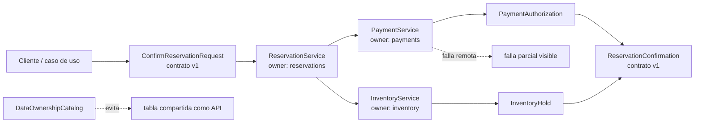

# 08. Microservicios

| Campo | Valor |
|-------|-------|
| Estado | `draft` |
| Issue | [#35](https://github.com/jeresoftx/rust-software-architecture/issues/35), [#31](https://github.com/jeresoftx/rust-software-architecture/issues/31), [#29](https://github.com/jeresoftx/rust-software-architecture/issues/29), [#36](https://github.com/jeresoftx/rust-software-architecture/issues/36) |
| PR | Pendiente |
| Milestone | `08. Microservicios` |
| Módulo Rust | `src/microservices.rs` |
| Ejemplos | `examples/08_basico.rs`, `examples/08_intermedio.rs`, `examples/08_realista.rs` |
| Soluciones | `examples/soluciones/08_microservicios.rs`, `examples/08_solucion.rs` |
| Diagramas | `diagrams/08-microservicios.md` |

Microservicios significa partir un sistema en servicios pequeños, autónomos y
desplegables de forma independiente alrededor de límites de negocio. No es una
versión "más profesional" del monolito ni el destino natural de todo sistema.
Es una decisión cara que solo conviene cuando el costo de coordinación interna
supera el costo de operar una red de servicios.

En el motor de reservas educativo, separar reservas, pagos, notificaciones e
inventario puede permitir equipos y despliegues independientes. También puede
crear latencia, fallas parciales, duplicación de contratos, consistencia
eventual y más trabajo operativo. Este capítulo enseña a decidir esa frontera
sin romantizar la distribución.

## 1. Concepto

Un microservicio es una unidad de software con responsabilidad de negocio
delimitada, contrato explícito y ciclo de despliegue propio. Sus piezas
principales son:

- **límite de servicio:** qué problema resuelve y qué decisiones le pertenecen;
- **datos propios:** estado que el servicio gobierna sin compartir tablas como
  si fueran API;
- **contrato:** interfaz estable para colaborar con otros servicios;
- **comunicación:** llamada síncrona, evento, cola o integración por batch;
- **operación:** despliegue, monitoreo, alertas, trazas, reintentos y soporte;
- **propiedad:** equipo o responsable que entiende el servicio y sus costos.

La palabra "micro" no habla de líneas de código. Habla de autonomía real. Un
servicio pequeño que comparte base de datos, despliegue y decisiones con todos
los demás no es autónomo; solo es un módulo distribuido con más red de por
medio.

## 2. Problema

Después de arquitectura orientada a eventos, el curso ya entiende integración
por contratos. El siguiente dolor aparece cuando los límites internos empiezan
a chocar con necesidades de evolución independiente:

- reservas cambia más rápido que inventario;
- pagos requiere controles, auditoría y despliegues con más cuidado;
- notificaciones puede escalar por volumen sin escalar todo el sistema;
- analítica necesita consumir hechos sin bloquear la operación principal;
- equipos distintos pueden necesitar ownership claro.

Si todo vive dentro del mismo despliegue, coordinar cambios puede volverse
lento. Pero distribuir demasiado pronto cambia un problema de diseño interno
por muchos problemas de red, operación y consistencia.

Microservicios intenta comprar autonomía con distribución. El precio se paga en
fallas parciales, contratos, observabilidad, datos duplicados y coordinación
entre equipos.

## 3. Alternativas

### Monolito modular

Debe ser la opción base cuando el equipo aún aprende el dominio o cuando el
producto necesita cambiar rápido sin operación distribuida. Permite límites
claros sin pagar red, despliegues múltiples ni consistencia eventual.

### Arquitectura hexagonal por módulos

Permite aislar dominio e infraestructura sin separar despliegues. Es útil
cuando se quiere preparar fronteras sustituibles antes de decidir si conviene
distribuir.

### Servicios internos grandes

Pueden funcionar cuando una frontera necesita despliegue propio, pero todavía
no justifica partirse en servicios pequeños. Reducen la cantidad de piezas
operativas.

### Microservicios

Ganan cuando hay límites de negocio estables, ownership claro, necesidad de
despliegue independiente y capacidad operativa suficiente. Pierden cuando se
usan para esconder un dominio mal entendido o para perseguir una moda.

## 4. Modelo Rust esperado

El modelo mínimo debe representar:

- límites de servicio explícitos para reservas, pagos e inventario;
- contratos de solicitud y respuesta entre servicios;
- ownership de datos por servicio;
- una llamada síncrona con error de servicio remoto;
- una decisión que no pueda depender de tablas compartidas;
- pruebas que demuestren frontera, contrato, falla parcial y autonomía básica.

El objetivo no es crear un framework HTTP. El objetivo es que el lector vea que
microservicios agrega una frontera operativa real: cada servicio decide sobre
sus datos y solo colabora mediante contratos explícitos.

El modelo se implementa en `src/microservices.rs` y se valida con pruebas que
cubren confirmación entre servicios mediante contratos explícitos, ownership de
tablas por servicio y falla remota visible sin confirmar estado local.

## 5. Invariantes

El capítulo debe proteger estas reglas:

- un servicio gobierna sus propios datos;
- otros servicios no leen ni escriben sus tablas internas;
- cada colaboración cruza un contrato explícito;
- una falla remota debe ser visible como falla parcial;
- separar despliegues no elimina la necesidad de modelar bien el dominio;
- duplicar datos de lectura requiere trazabilidad y sincronización explícitas;
- microservicios no se presentan como destino inevitable;
- si no hay ownership operativo, no hay autonomía real.

Estas invariantes evitan confundir "muchos repositorios" con arquitectura. La
arquitectura aparece cuando las fronteras reducen coordinación sin destruir la
capacidad de entender y operar el sistema.

## 6. Costos

Microservicios agregan costo:

- más despliegues, configuración y monitoreo;
- fallas parciales y latencia de red;
- contratos versionados entre servicios;
- consistencia eventual y procesos de compensación;
- duplicación de datos para lectura;
- pruebas de integración y ambientes más complejos;
- necesidad de ownership claro por equipo o responsable;
- observabilidad distribuida para explicar incidentes.

Su beneficio principal es la autonomía evolutiva cuando el dominio y la
organización ya justifican esa inversión. Su costo principal es que el sistema
deja de fallar como un proceso único y empieza a fallar como una red viva.

El análisis de costos vive también como nota educativa en
`benches/08-microservicios-costos.md`. Este capítulo no usa `cargo bench`
porque medir el modelo en memoria no enseña la decisión arquitectónica; lo
importante es comparar autonomía, ownership, contratos, fallas parciales,
observabilidad y costo operativo.

## 7. Modos de falla

Microservicios fallan cuando:

- se separan por capas técnicas en vez de límites de negocio;
- comparten una base de datos como contrato oculto;
- cada llamada síncrona crea una cadena frágil de disponibilidad;
- nadie versiona contratos;
- no hay trazas, métricas ni logs correlacionables;
- no existe responsable operativo por servicio;
- se distribuye el sistema antes de entender el monolito;
- se usa la palabra "microservicio" para justificar complejidad innecesaria.

## 8. Relación con otros cursos

Este capítulo se apoya en `rust-system-design` para capacidad, APIs y
escenarios de producto; en `rust-distributed-systems` para fallas parciales,
timeouts y coordinación; en `rust-database-internals` para ownership de datos;
y en `rust-cloud` para despliegue, redes, observabilidad y costos.

También conversa con `rust-docker`, porque los laboratorios de servicios,
brokers y bases de datos se montarán ahí cuando el curso necesite
infraestructura. En este repositorio, el modelo se mantiene en memoria para que
la frontera conceptual sea visible antes de introducir plataformas.

## 9. Diagrama Mermaid

El diagrama canónico vive en
[`diagrams/08-microservicios.md`](../diagrams/08-microservicios.md).



El servicio de reservas coordina una confirmación mediante contratos. Pagos e
inventario conservan sus propios datos y responden con resultados explícitos.
El diagrama deja visibles dos costos: una tabla compartida rompe la frontera, y
un servicio remoto puede fallar aunque el proceso local esté sano.

## 10. Ejemplos progresivos

Los ejemplos se ejecutan con `cargo run --example` y avanzan desde ownership de
datos hasta falla parcial.

| Nivel | Archivo | Propósito |
|-------|---------|-----------|
| Básico | `examples/08_basico.rs` | Reclamar ownership de tablas y rechazar una tabla compartida como API. |
| Intermedio | `examples/08_intermedio.rs` | Confirmar una reserva mediante contratos entre reservas, pagos e inventario. |
| Realista | `examples/08_realista.rs` | Mostrar que una falla remota impide confirmar estado local. |

```bash
cargo run --example 08_basico
cargo run --example 08_intermedio
cargo run --example 08_realista
```

El ejemplo básico enseña que autonomía empieza por datos propios. El intermedio
muestra colaboración mediante contratos sin compartir tablas internas. El
realista vuelve explícito el costo de distribuir: una dependencia remota puede
estar caída y el servicio local debe responder sin inventar éxito.

## 11. Ejercicios

### Nivel 1: reconocer autonomía real

Lee `src/microservices.rs` y responde:

1. ¿Qué tipo representa el contrato de solicitud entre servicios?
2. ¿Qué trait expone el nombre y la versión de un contrato?
3. ¿Qué estructura registra ownership de tablas?
4. ¿Qué error aparece cuando dos servicios reclaman la misma tabla?
5. ¿Qué error representa una dependencia remota caída?

La meta es distinguir servicio, contrato, datos propios y falla parcial. Una
buena respuesta explica por qué separar código sin separar ownership no produce
autonomía real.

### Nivel 2: confirmar sin compartir tablas

Usa `DataOwnershipCatalog` para asignar tablas a reservas, pagos e inventario.
Después confirma una reserva con `ReservationService`, `PaymentService` e
`InventoryService`. Verifica que cada servicio cambie solo su propio estado y
que la confirmación viaje por contrato explícito.

Pistas:

- `ConfirmReservationRequest::new` valida el contrato de entrada;
- `ReservationService::confirm` coordina pagos e inventario por API explícita;
- `PaymentService::authorized_count()` solo cambia dentro de pagos;
- `InventoryService::held_count()` solo cambia dentro de inventario;
- ningún ejercicio debe leer tablas internas de otro servicio.

### Nivel 3: decidir si conviene distribuir

Imagina que el motor de reservas creció: pagos tiene auditoría y controles
propios, inventario cambia por proveedores externos, y reservas necesita
desplegarse más seguido. Antes de partir el sistema, responde:

- ¿qué frontera separarías primero y por qué?
- ¿qué datos gobernaría cada servicio?
- ¿qué contrato versionarías para evitar romper consumidores?
- ¿qué harías cuando pagos no responde?
- ¿qué señales de observabilidad exigirías antes de producción?
- ¿cuándo seguirías prefiriendo un monolito modular?

Una buena respuesta no idealiza microservicios. Debe comparar autonomía contra
costo operativo y explicar qué equipo o responsable cuidaría cada frontera.

## Solución sugerida

La solución de referencia vive en
[`examples/soluciones/08_microservicios.rs`](../examples/soluciones/08_microservicios.rs).
También se compila como `examples/08_solucion.rs`.

Una buena solución conserva estas ideas:

- cada servicio reclama datos propios;
- la confirmación cruza contratos explícitos;
- pagos e inventario cambian su propio estado, no el de reservas;
- una falla remota queda visible y no confirma estado local falso;
- la solución no introduce infraestructura externa antes de entender la
  frontera.

Ejecutar la solución:

```bash
cargo run --example 08_solucion
```

## 12. Cierre editorial

Estado actual: `draft`.

Este capítulo todavía no está `reviewed` ni `published`. Ya cuenta con
especificación conceptual, modelo Rust mínimo, diagrama Mermaid, ejemplos
progresivos, ejercicios, solución sugerida y análisis de costos. Requiere
revisión humana explícita de Joel antes de avanzar de estado editorial.

### Decisiones registradas

- Microservicios se enseñan después de arquitectura orientada a eventos porque
  primero se necesita entender integración por contratos.
- Este capítulo evita presentar microservicios como destino inevitable.
- La autonomía de un microservicio requiere ownership de datos, contrato,
  despliegue y operación; no basta con partir código.
- El costo central de microservicios es operar fallas parciales y consistencia
  eventual con trazabilidad suficiente.
- El modelo Rust mínimo protege contratos explícitos, ownership de datos y
  fallas remotas visibles sin `unsafe` ni dependencias externas.
- Los ejemplos progresivos enseñan ownership de datos, colaboración por
  contratos y falla parcial sin introducir infraestructura externa.
- Los costos se enseñan como benchmark conceptual: autonomía, ownership,
  contratos y operación importan más que medir el modelo en memoria.
